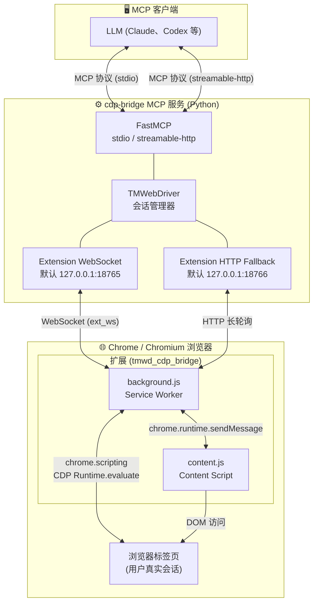

<p align="center">
  
</p>

<h1 align="center">CDP Bridge MCP</h1>

<div align="center">

[](https://pypi.org/project/cdp-bridge/)
[](https://www.python.org/)
[](https://modelcontextprotocol.io/)
[](https://github.com/Unagi-cq/cdp-bridge-mcp)

</div>

<p align="center">
CDP Bridge MCP 是一个连接 MCP 客户端与真实浏览器会话的桥接服务。它通过配套的 Chromium 扩展接入浏览器页面，让大模型客户端可以读取标签页、扫描页面、执行 JavaScript、截图和导航。
</p>

<p align="center">
中文 | <a href="./doc/README_EN.md">English</a>
</p>

# 演示视频

| 查询小红书平台 Anthropic 最新动态 | 读取 CSDN 网站作者后台数据分析 |
| --- | --- |
| [观看视频](https://www.bilibili.com/video/BV1RDRQBrEY7/?p=2) | [观看视频](https://www.bilibili.com/video/BV1RDRQBrEY7/) |

# 项目介绍

CDP Bridge MCP 适合需要让大模型操作真实浏览器的场景。**和无状态 HTTP 抓取不同，它连接的是你已经登录、已经打开的浏览器页面，因此可以复用真实浏览器里的登录态、Cookie、页面状态和前端渲染结果。**

代码仓库：<https://github.com/Unagi-cq/cdp-bridge-mcp>

> 本项目使用 Python 编写并发布。MCP 支持 `stdio` 和 `streamable-http` 两种传输模式。

# 项目优势

**为什么用 CDP Bridge MCP，而不是 Playwright MCP、Kimi Bridge 或 Chrome DevTools MCP？**

Playwright MCP 和 Chrome DevTools MCP 都很强，但它们更偏向“自动化测试 / 调试协议 / 新开浏览器实例”的工作流。Kimi Bridge 的功能权限有限，倾向于通过截图发给视觉模型来完成任务。

CDP Bridge MCP 的目标不同：它更关注让 LLM 或 Agent 产品接管用户正在使用的真实浏览器会话。

- **复用真实登录态**：CDP Bridge MCP 连接的是你已经打开、已经登录的浏览器标签页，可以直接使用现有 Cookie、登录状态、页面上下文和前端渲染结果。很多需要账号态的网站，不需要重新登录或额外搬运 Cookie。
- **更适合日常浏览器协作**：Playwright 更适合可重复、可脚本化的自动化流程，而 CDP Bridge MCP 更适合 LLM 在用户当前页面上做读取、分析、点击前判断、执行脚本、截图等交互式任务。
- **页面内容更适合 LLM 消费**：`browser_scan` 会对页面 HTML 做简化，过滤脚本、样式和不可见元素，尽量保留对模型有用的正文、控件和结构信息，减少 token 浪费。
- **启动链路轻量**：服务端发布到 PyPI 后可直接 `uvx cdp-bridge` 启动，浏览器端加载扩展即可连接，不需要编写 Playwright 脚本，也不需要为每个浏览器实例单独配置调试参数。
- **适合远端部署和 Agent 产品开发**：如果使用 `streamable-http` 模式，`cdp-bridge` 可以作为一个常驻服务部署在远端服务器上。Agent 后端通过 MCP HTTP 端点连接服务，用户浏览器里的扩展通过 WebSocket 连接同一个服务。这样产品侧不需要托管用户的浏览器，也不需要把账号态搬到云端；用户只要安装扩展并配置 `Bridge Host` 和 `Port`，Agent 就能在用户授权的真实浏览器会话里完成读取、分析和自动化操作。
- **个人使用和团队产品都能覆盖**：个人用户可以用默认 `stdio + 127.0.0.1:18765` 快速接入本机浏览器；团队或产品开发者可以用 `streamable-http + 远端域名 + WebSocket` 搭建浏览器控制通道，把真实浏览器能力集成进自己的 Agent 产品、客服工作台、数据采集后台或内部自动化系统。

典型部署形态如下：

```text
Agent 产品 / MCP 客户端  --streamable-http-->  远端 cdp-bridge MCP 服务
用户浏览器扩展           --WebSocket------->  同一个 cdp-bridge MCP 服务
cdp-bridge              --chrome.scripting / CDP--> 用户真实浏览器标签页
```

因此，如果你的目标是“让模型控制一个专门启动的自动化浏览器”，Playwright MCP 很合适；如果你的目标是“调试 Chrome 或精细操作 DevTools 协议”，Chrome DevTools MCP 很合适；如果你的目标是“让模型或 Agent 产品读取和操作用户当前正在使用的真实浏览器页面”，CDP Bridge MCP 更贴近这个场景。

## 系统架构

<p align="center">
  
</p>



**数据流简述：**

1. MCP 客户端通过 **stdio**（子进程）或 **streamable-http**（HTTP 端点）连接 `cdp-bridge` 服务。
2. TMWebDriver 启动供浏览器扩展连接的 WebSocket（默认 :18765）和内部 HTTP fallback（默认 :18766）。
3. 浏览器扩展通过 WebSocket 连接服务端，上报所有已打开标签页（`ext_ws` 模式），服务端为每个标签页创建 Session。
4. 当 MCP 工具被调用（如 `browser_execute_js`），服务端将 JS 代码通过 WebSocket 发送到扩展。
5. 扩展的 background.js 优先使用 `chrome.scripting.executeScript` 在页面 MAIN world 执行；若页面有 CSP 限制，自动降级为 CDP `Runtime.evaluate`。
6. 执行结果通过 WebSocket 返回服务端，再由 MCP 协议返回给 LLM 客户端。

## 可用工具

MCP 服务当前暴露以下工具：

| 工具名 | 说明 |
| --- | --- |
| `browser_get_tabs` | 获取已连接标签页列表 |
| `browser_scan` | 扫描当前页面内容，可返回简化 HTML 或纯文本 |
| `browser_execute_js` | 在当前标签页执行 JavaScript |
| `browser_switch_tab` | 切换 MCP 活动标签页，不改变用户当前可见的 Chrome 标签页 |
| `browser_batch` | 批量执行扩展/CDP 命令，适合需要复用 CDP 上下文的复杂操作 |
| `browser_wait` | 轮询 JavaScript 条件直到返回真值或超时 |
| `browser_navigate` | 跳转当前标签页到指定 URL |
| `browser_screenshot` | 获取页面截图 |

# 快速使用

下面是默认配置下最快的使用流程：MCP 使用 `stdio`，浏览器扩展连接本机 WebSocket `127.0.0.1:18765`。

1. 安装 `uv`。
2. 在 Chrome 或其他 Chromium 浏览器中打开 `chrome://extensions/`，开启“开发者模式”。
3. 点击“加载已解压的扩展程序”，选择 `src/cdp_bridge/tmwd_cdp_bridge` 文件夹。
4. 在 MCP 客户端里添加 `cdp-bridge`。

以 Codex 为例：

```bash
codex mcp add cdp-bridge uvx cdp-bridge@latest
```

以 Claude Code 为例：

```bash
claude mcp add cdp-bridge uvx cdp-bridge@latest
```

配置完成后，在浏览器里打开任意页面，然后在 MCP 客户端调用 `browser_get_tabs` 或 `browser_scan`。扩展会自动连接 MCP 进程启动的 WebSocket 服务；如果首次看到 `ERR_CONNECTION_REFUSED`，等待几秒自动重连即可。

# 如何使用

## 安装步骤

1. 将项目中提供的浏览器插件 `src/cdp_bridge/tmwd_cdp_bridge` 文件夹加载到 Chrome 或其他 Chromium 浏览器。
2. 在 MCP 客户端配置 CDP Bridge MCP。

然后就可以正常使用了。下面详细介绍上述安装步骤。

> **首次使用**：加载扩展后首次连接 WebSocket 会产生 `ERR_CONNECTION_REFUSED` 报错，这是正常的。扩展内置自动重连机制（每 ~5 秒探测一次），当检测到后端服务启动后会自动恢复连接，无需手动重启扩展。

## 使用流程

1. **加载浏览器扩展**（参考下方步骤）
2. **配置 MCP 客户端**（参考下方步骤）
3. **使用任意浏览器工具**（如 `browser_get_tabs`），MCP 服务启动后 WebSocket 服务会自动就绪
4. 浏览器扩展会在数秒内自动连接，之后即可正常使用所有工具

## 加载浏览器

在 Chrome 或其他 Chromium 浏览器中加载：

1. 打开 `chrome://extensions/`。
2. 开启“开发者模式”。
3. 点击“加载已解压的扩展程序”。
4. 选择 `src/cdp_bridge/tmwd_cdp_bridge` 文件夹。

默认情况下，扩展会连接本地 WebSocket 服务 `127.0.0.1:18765`。

扩展弹窗里可以修改连接配置：

<p align="center">
  
</p>

- `Bridge Host`：可填写 `127.0.0.1`、`localhost` 或域名。填写域名时可以不填端口，例如 `bridge.example.com`。
- `Port`：WebSocket 端口。使用本地默认配置时是 `18765`；如果 MCP 启动时使用了 `--ws-port`，这里需要填同一个端口。域名接入并且服务走默认 WebSocket 端口时，可以留空。

## 配置 MCP

先确认电脑上已安装 `uv`。CDP Bridge MCP 通过 `uvx cdp-bridge@latest` 启动。

### 两种传输模式

CDP Bridge 支持两种 MCP 传输模式，可根据使用场景选择：

| 模式 | 原理 | 适用场景 |
|------|------|----------|
| `stdio`（默认） | MCP 客户端以子进程启动服务，通过标准输入/输出通信 | Claude Desktop、Claude Code、Codex 等本地客户端 |
| `streamable-http` | 服务以独立 HTTP 进程运行，客户端通过 HTTP 请求连接 | 多客户端共享、Docker 部署、服务常驻 |

### 启动参数

| 参数 | 默认值 | 适用模式 | 说明 |
| --- | --- | --- | --- |
| `--transport` | `stdio` | 两种模式 | MCP 传输模式。可选 `stdio` 或 `streamable-http`。 |
| `--ws-port` | `18765` | 两种模式 | 浏览器扩展连接的 WebSocket 端口。无论使用 `stdio` 还是 `streamable-http`，都可以配置。 |
| `--port` | `8000` | 仅 `streamable-http` | MCP HTTP 服务端口。只在 `--transport streamable-http` 时使用，客户端连接地址是 `http://127.0.0.1:<port>/mcp`。 |

注意：`--ws-port` 是浏览器扩展连接后端的端口；`--port` 是 MCP 客户端连接后端的 HTTP 端口。两者不是同一个端口。

### 脚本测试

```bash
# stdio 模式（默认）
uvx cdp-bridge@latest

# stdio 模式，指定 WebSocket 端口
uvx cdp-bridge@latest --ws-port 18767

# streamable-http 模式，指定 MCP HTTP 端口
uvx cdp-bridge@latest --transport streamable-http --port 8000

# streamable-http 模式，同时指定 MCP HTTP 端口和浏览器扩展 WebSocket 端口
uvx cdp-bridge@latest --transport streamable-http --port 8000 --ws-port 18767
```

不传 `--transport` 时默认使用 `stdio`。`stdio` 模式没有 MCP HTTP 端口；`streamable-http` 模式的 MCP 服务地址为 `http://127.0.0.1:<port>/mcp`。

### 标准配置

**stdio 模式：**

```json
{
  "mcpServers": {
    "cdp-bridge": {
      "command": "uvx",
      "args": ["cdp-bridge@latest"]
    }
  }
}
```

如果需要修改浏览器扩展连接的 WebSocket 端口，把 `--ws-port` 加到 `args` 里：

```json
{
  "mcpServers": {
    "cdp-bridge": {
      "command": "uvx",
      "args": ["cdp-bridge@latest", "--ws-port", "18767"]
    }
  }
}
```

**streamable-http 模式：**

先启动服务：
```bash
uvx cdp-bridge@latest --transport streamable-http --port 8000
```

如果同时要修改浏览器扩展连接的 WebSocket 端口：

```bash
uvx cdp-bridge@latest --transport streamable-http --port 8000 --ws-port 18767
```

再配置客户端连接：
```json
{
  "mcpServers": {
    "cdp-bridge": {
      "type": "streamableHttp",
      "url": "http://127.0.0.1:8000/mcp"
    }
  }
}
```

### Claude Code

```bash
# stdio 模式
claude mcp add cdp-bridge uvx cdp-bridge@latest

# streamable-http 模式（先启动服务，再注册）
claude mcp add cdp-bridge --transport streamable-http http://127.0.0.1:8000/mcp
```

### Codex

```bash
# stdio 模式
codex mcp add cdp-bridge uvx cdp-bridge@latest

# streamable-http 模式
codex mcp add cdp-bridge --transport streamable-http --url http://127.0.0.1:8000/mcp
```

### opencode

在 `~/.config/opencode/opencode.json` 里配置：

**stdio 模式：**
```json
{
  "$schema": "https://opencode.ai/config.json",
  "mcp": {
    "cdp-bridge": {
      "type": "local",
      "command": [
        "uvx",
        "cdp-bridge@latest"
      ],
      "enabled": true
    }
  }
}
```

**streamable-http 模式：**
```json
{
  "$schema": "https://opencode.ai/config.json",
  "mcp": {
    "cdp-bridge": {
      "type": "remote",
      "url": "http://127.0.0.1:8000/mcp",
      "enabled": true
    }
  }
}
```

### OpenClaw

可以使用 OpenClaw CLI 写入 MCP 配置：

```bash
# stdio 模式
openclaw mcp set cdp-bridge '{"command":"uvx","args":["cdp-bridge@latest"]}'

# streamable-http 模式
openclaw mcp set cdp-bridge '{"type":"streamableHttp","url":"http://127.0.0.1:8000/mcp"}'
```

等价的 stdio 配置结构：
```json
{
  "mcp": {
    "servers": {
      "cdp-bridge": {
        "command": "uvx",
        "args": ["cdp-bridge@latest"]
      }
    }
  }
}
```

### 注意事项

- 本项目需要 Python 3.10 或更高版本。
- 浏览器扩展内置自动重连机制：首次连接失败后会持续探测 WebSocket 服务（每 ~5 秒），当 MCP 服务启动后会自动恢复连接。如果看到 ERR_CONNECTION_REFUSED，等待数秒即可自动恢复。
- 页面自动化会运行在你的真实浏览器会话中，请只连接你信任的 MCP 客户端。

## 致谢

本项目的浏览器插件和部分代码参考并来源于 [GenericAgent](https://github.com/lsdefine/GenericAgent)。感谢原项目作者的开源工作。
