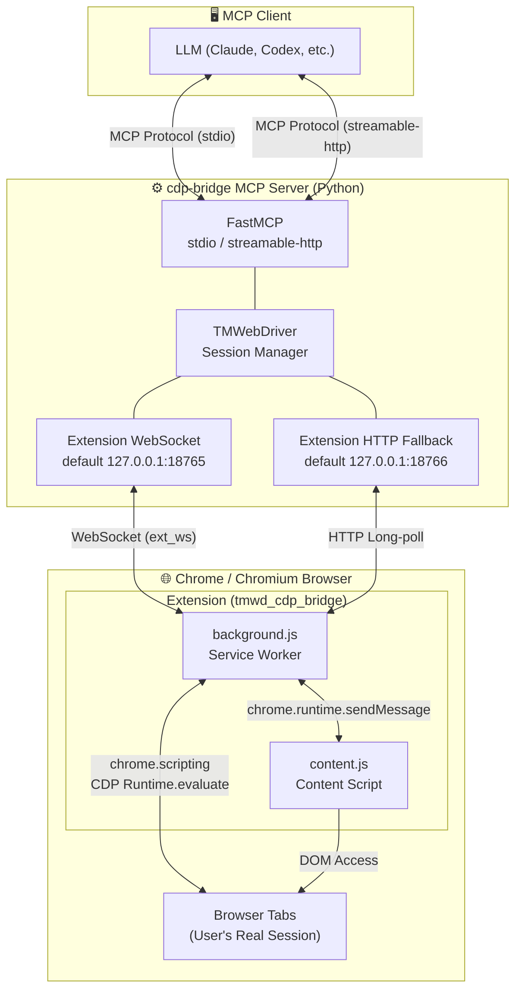

<p align="center">
  
</p>

<h1 align="center">CDP Bridge MCP</h1>

<div align="center">

[](https://pypi.org/project/cdp-bridge/)
[](https://www.python.org/)
[](https://modelcontextprotocol.io/)
[](https://github.com/Unagi-cq/cdp-bridge-mcp)

</div>

<p align="center">
CDP Bridge MCP is a bridge service that connects MCP clients to real browser sessions. Through its companion Chromium extension, model clients can list tabs, scan pages, execute JavaScript, capture screenshots, and navigate pages.
</p>

<p align="center">
<a href="../README.md">中文</a> | English
</p>

# Demo Videos

| Search Anthropic updates on Xiaohongshu | Read CSDN author analytics |
| --- | --- |
| [Watch video](https://www.bilibili.com/video/BV1RDRQBrEY7/?p=2) | [Watch video](https://www.bilibili.com/video/BV1RDRQBrEY7/) |

# Introduction

CDP Bridge MCP is designed for scenarios where large language models need to operate a real browser. **Unlike stateless HTTP fetching, it connects to browser pages that are already open and already logged in, so it can reuse the browser's login state, cookies, page state, and rendered frontend result.**

Repository: <https://github.com/Unagi-cq/cdp-bridge-mcp>

> This project is written and distributed in Python. MCP supports two transport modes: `stdio` and `streamable-http`.

# Project Advantages

**Why use CDP Bridge MCP instead of Playwright MCP, Kimi Bridge, or Chrome DevTools MCP?**

Playwright MCP and Chrome DevTools MCP are both powerful, but they are more oriented toward automated testing, debugging protocols, or newly launched browser instances. Kimi Bridge has a more limited permission model and tends to rely on screenshots sent to vision models.

CDP Bridge MCP has a different goal: it focuses on letting LLMs or Agent products work with the real browser session the user is already using.

- **Reuse real login state**: CDP Bridge MCP connects to browser tabs that are already open and logged in. It can directly use existing cookies, login state, page context, and rendered frontend output. For many account-based websites, there is no need to log in again or manually transfer cookies.
- **Better for everyday browser collaboration**: Playwright is a strong fit for repeatable and scriptable automation workflows. CDP Bridge MCP is better suited for interactive tasks on the user's current page, such as reading, analyzing, checking before clicking, executing scripts, and taking screenshots.
- **Page content is optimized for LLMs**: `browser_scan` simplifies page HTML by filtering scripts, styles, and invisible elements while keeping useful text, controls, and structure, reducing token waste.
- **Lightweight startup flow**: Once published to PyPI, the server can be started with `uvx cdp-bridge`. The browser side only needs the extension to be loaded. There is no need to write Playwright scripts or configure debug parameters for each browser instance.
- **Built for remote deployment and Agent product development**: In `streamable-http` mode, `cdp-bridge` can run as a persistent service on a remote server. The Agent backend connects to the service through the MCP HTTP endpoint, while the user's browser extension connects to the same service through WebSocket. This means the product side does not need to host the user's browser or move the user's account state into the cloud. After the user installs the extension and configures `Bridge Host` and `Port`, the Agent can read, analyze, and automate pages in the user's authorized real browser session.
- **Useful for both individuals and product teams**: Individual users can quickly connect a local browser with the default `stdio + 127.0.0.1:18765` setup. Teams and product builders can use `streamable-http + remote domain + WebSocket` to build a browser-control channel and integrate real-browser capabilities into Agent products, support workbenches, data collection backends, or internal automation systems.

A typical product deployment looks like this:

```text
Agent product / MCP client  --streamable-http-->  remote cdp-bridge MCP service
User browser extension      --WebSocket------->  the same cdp-bridge MCP service
cdp-bridge                  --chrome.scripting / CDP--> user's real browser tabs
```

So if your goal is to let a model control a dedicated automation browser, Playwright MCP is a good fit. If your goal is to debug Chrome or work closely with the DevTools protocol, Chrome DevTools MCP is a good fit. If your goal is to let a model or Agent product read and operate on the real browser page the user is currently using, CDP Bridge MCP is closer to that scenario.

## System Architecture

<p align="center">
  
</p>



**Data Flow:**

1. The MCP client connects to the `cdp-bridge` service via **stdio** (subprocess) or **streamable-http** (HTTP endpoint).
2. TMWebDriver starts the browser-extension WebSocket (default :18765) and the internal HTTP fallback (default :18766).
3. The browser extension connects to the server through WebSocket and reports all open tabs (`ext_ws` mode). The server creates a Session for each tab.
4. When an MCP tool is called, such as `browser_execute_js`, the server sends JavaScript code to the extension through WebSocket.
5. The extension's background.js first tries `chrome.scripting.executeScript` in the page's MAIN world. If the page has CSP restrictions, it automatically falls back to CDP `Runtime.evaluate`.
6. Execution results are returned to the server through WebSocket, then relayed to the LLM client through the MCP protocol.

## Available Tools

The MCP service currently exposes these tools:

| Tool | Description |
| --- | --- |
| `browser_get_tabs` | Get the list of connected browser tabs |
| `browser_scan` | Scan the active page as simplified HTML or plain text |
| `browser_execute_js` | Execute JavaScript in the active tab |
| `browser_switch_tab` | Switch the active MCP tab without changing the user's visible Chrome tab |
| `browser_batch` | Run extension/CDP commands in a single request for complex flows |
| `browser_wait` | Poll a JavaScript condition until it returns a truthy value or times out |
| `browser_navigate` | Navigate the active tab to a URL |
| `browser_screenshot` | Capture a page screenshot |

# Quick Start

This is the fastest path with the default setup: MCP uses `stdio`, and the browser extension connects to the local WebSocket service at `127.0.0.1:18765`.

1. Install `uv`.
2. Open `chrome://extensions/` in Chrome or another Chromium browser and enable "Developer mode".
3. Click "Load unpacked" and select the `src/cdp_bridge/tmwd_cdp_bridge` folder.
4. Add `cdp-bridge` to your MCP client.

For Codex:

```bash
codex mcp add cdp-bridge uvx cdp-bridge@latest
```

For Claude Code:

```bash
claude mcp add cdp-bridge uvx cdp-bridge@latest
```

After configuration, open any page in the browser, then call `browser_get_tabs` or `browser_scan` from your MCP client. The extension will automatically connect to the WebSocket service started by the MCP process. If you see `ERR_CONNECTION_REFUSED` on first use, wait a few seconds and the extension will reconnect automatically.

# Usage

## Installation Steps

1. Load the browser extension folder `src/cdp_bridge/tmwd_cdp_bridge` into Chrome or another Chromium-based browser.
2. Configure CDP Bridge MCP in your MCP client.

After that, the MCP server can be used normally. The detailed steps are listed below.

> **First use**: after loading the extension, the first WebSocket connection may show `ERR_CONNECTION_REFUSED`. This is expected. The extension has built-in automatic reconnect logic and probes about every 5 seconds. Once the backend service starts, the connection will recover without restarting the extension.

## Usage Flow

1. **Load the browser extension** (see below).
2. **Configure the MCP client** (see below).
3. **Use any browser tool**, such as `browser_get_tabs`. After the MCP service starts, the WebSocket service will be ready automatically.
4. The browser extension will connect within a few seconds, and all tools can be used normally.

## Load the Browser Extension

In Chrome or another Chromium-based browser:

1. Open `chrome://extensions/`.
2. Enable "Developer mode".
3. Click "Load unpacked".
4. Select the `src/cdp_bridge/tmwd_cdp_bridge` folder.

By default, the extension connects to the local WebSocket service at `127.0.0.1:18765`.

You can change the connection settings from the extension popup:

<p align="center">
  
</p>

- `Bridge Host`: can be `127.0.0.1`, `localhost`, or a domain name. When using a domain, the port can be omitted, for example `bridge.example.com`.
- `Port`: the WebSocket port. The local default is `18765`. If the MCP service was started with `--ws-port`, set the same port here. For a domain-based setup using the default WebSocket port, this field can be left empty.

## Configure MCP

First, make sure `uv` is installed. CDP Bridge MCP is started through `uvx cdp-bridge@latest`.

### Two Transport Modes

CDP Bridge supports two MCP transport modes:

| Mode | How it Works | Best For |
|------|-------------|----------|
| `stdio` (default) | MCP client launches the server as a subprocess, communicating over stdin/stdout | Claude Desktop, Claude Code, Codex, and other local clients |
| `streamable-http` | Server runs as a standalone HTTP process, clients connect via HTTP requests | Remote access, multi-client sharing, Docker deployments, persistent services |

### Startup Parameters

| Parameter | Default | Applies To | Description |
| --- | --- | --- | --- |
| `--transport` | `stdio` | Both modes | MCP transport mode. Choose `stdio` or `streamable-http`. |
| `--ws-port` | `18765` | Both modes | WebSocket port used by the browser extension. It can be configured in either `stdio` or `streamable-http` mode. |
| `--port` | `8000` | `streamable-http` only | MCP HTTP service port. It is used only with `--transport streamable-http`. The client URL is `http://127.0.0.1:<port>/mcp`. |

Note: `--ws-port` is the backend port used by the browser extension. `--port` is the HTTP port used by MCP clients. They are not the same port.

### Script Test

```bash
# stdio mode (default)
uvx cdp-bridge@latest

# stdio mode with a custom WebSocket port
uvx cdp-bridge@latest --ws-port 18767

# streamable-http mode with a custom MCP HTTP port
uvx cdp-bridge@latest --transport streamable-http --port 8000

# streamable-http mode with both MCP HTTP port and browser-extension WebSocket port
uvx cdp-bridge@latest --transport streamable-http --port 8000 --ws-port 18767
```

When `--transport` is omitted, `stdio` is used by default. `stdio` mode has no MCP HTTP port. In `streamable-http` mode, the MCP service URL is `http://127.0.0.1:<port>/mcp`.

### Standard Configuration

**stdio mode:**

```json
{
  "mcpServers": {
    "cdp-bridge": {
      "command": "uvx",
      "args": ["cdp-bridge@latest"]
    }
  }
}
```

If you need to change the WebSocket port used by the browser extension, add `--ws-port` to `args`:

```json
{
  "mcpServers": {
    "cdp-bridge": {
      "command": "uvx",
      "args": ["cdp-bridge@latest", "--ws-port", "18767"]
    }
  }
}
```

**streamable-http mode:**

First start the service:

```bash
uvx cdp-bridge@latest --transport streamable-http --port 8000
```

If you also need to change the WebSocket port used by the browser extension:

```bash
uvx cdp-bridge@latest --transport streamable-http --port 8000 --ws-port 18767
```

Then configure the client to connect:

```json
{
  "mcpServers": {
    "cdp-bridge": {
      "type": "streamableHttp",
      "url": "http://127.0.0.1:8000/mcp"
    }
  }
}
```

### Claude Code

```bash
# stdio mode
claude mcp add cdp-bridge uvx cdp-bridge@latest

# streamable-http mode (start the service first, then register it)
claude mcp add cdp-bridge --transport streamable-http http://127.0.0.1:8000/mcp
```

### Codex

```bash
# stdio mode
codex mcp add cdp-bridge uvx cdp-bridge@latest

# streamable-http mode
codex mcp add cdp-bridge --transport streamable-http --url http://127.0.0.1:8000/mcp
```

### opencode

Configure it in `~/.config/opencode/opencode.json`:

**stdio mode:**

```json
{
  "$schema": "https://opencode.ai/config.json",
  "mcp": {
    "cdp-bridge": {
      "type": "local",
      "command": [
        "uvx",
        "cdp-bridge@latest"
      ],
      "enabled": true
    }
  }
}
```

**streamable-http mode:**

```json
{
  "$schema": "https://opencode.ai/config.json",
  "mcp": {
    "cdp-bridge": {
      "type": "remote",
      "url": "http://127.0.0.1:8000/mcp",
      "enabled": true
    }
  }
}
```

### OpenClaw

You can write the MCP configuration with the OpenClaw CLI:

```bash
# stdio mode
openclaw mcp set cdp-bridge '{"command":"uvx","args":["cdp-bridge@latest"]}'

# streamable-http mode
openclaw mcp set cdp-bridge '{"type":"streamableHttp","url":"http://127.0.0.1:8000/mcp"}'
```

Equivalent stdio configuration shape:

```json
{
  "mcp": {
    "servers": {
      "cdp-bridge": {
        "command": "uvx",
        "args": ["cdp-bridge@latest"]
      }
    }
  }
}
```

### Notes

- This project requires Python 3.10 or newer.
- The browser extension has built-in automatic reconnect logic. If the first connection fails, it keeps probing the WebSocket service about every 5 seconds and reconnects once the MCP service is available. If you see `ERR_CONNECTION_REFUSED`, wait a few seconds.
- Browser automation runs in your real browser session, so only connect MCP clients that you trust.

## Acknowledgements

The browser extension and parts of the code in this project are based on and adapted from [GenericAgent](https://github.com/lsdefine/GenericAgent). Thanks to the original author for the open-source work.
