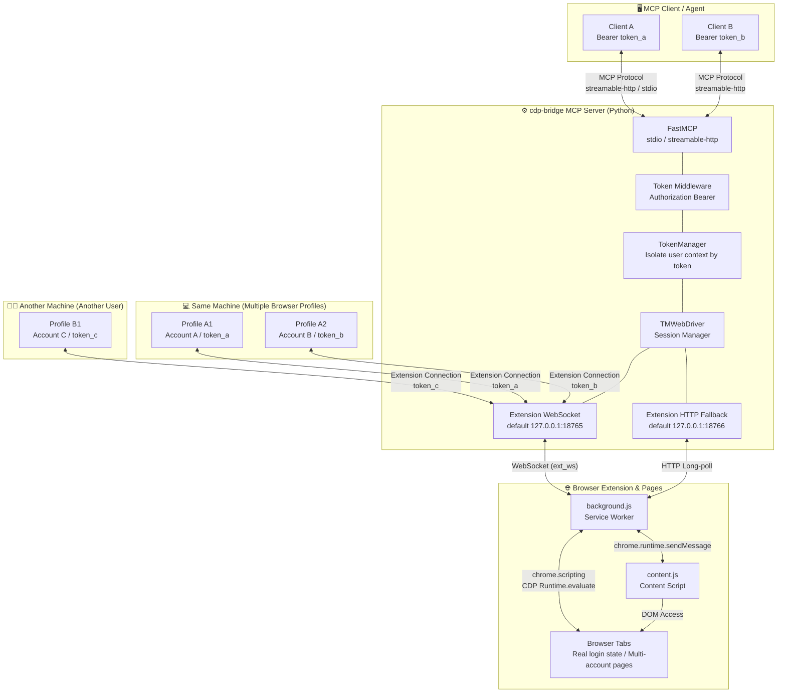
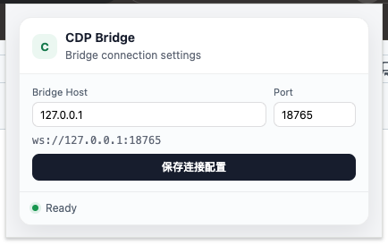

<p align="center">
  
</p>

<h1 align="center">CDP Bridge MCP</h1>

<div align="center">

[](https://pypi.org/project/cdp-bridge/)
[](https://www.python.org/)
[](https://modelcontextprotocol.io/)
[](https://github.com/Unagi-cq/cdp-bridge-mcp)

</div>

<p align="center">
CDP Bridge MCP is a bridge service that connects MCP clients to real browser sessions. Through its companion Chromium extension, any LLM client can seamlessly list tabs, scan pages, execute automation, capture screenshots, and navigate pages.
</p>

<p align="center">
<a href="../README.md">中文</a> | English
</p>

# Demo Videos

| Multi-account operations on Xiaohongshu from a single machine | Search Anthropic updates on Xiaohongshu | Read CSDN author analytics |
|---------------------------------------------------------------|------------------------------------------|-----------------------------|
| [Watch video](https://www.bilibili.com/video/BV1RDRQBrEY7) | [Watch video](https://www.bilibili.com/video/BV1RDRQBrEY7/?p=3) | [Watch video](https://www.bilibili.com/video/BV1RDRQBrEY7/?p=2) |

# Introduction

CDP Bridge MCP is designed for scenarios where large language models need to operate a real browser. **Unlike stateless HTTP fetching, it connects to browser pages that are already open and already logged in, so it can reuse the browser's login state, cookies, page state, and rendered frontend result.**

CDP Bridge MCP also supports multi-profile operations on a single machine and multi-user operations.

Repository: <https://github.com/Unagi-cq/cdp-bridge-mcp>

> This project is written and distributed in Python. MCP supports two transport modes: `stdio` and `streamable-http`.

# Project Advantages

**Why use CDP Bridge MCP instead of Playwright MCP, Kimi Bridge, or Chrome DevTools MCP?**

Playwright MCP and Chrome DevTools MCP are both powerful, but they are more oriented toward automated testing, debugging protocols, or newly launched browser instances. Kimi Bridge has a more limited permission model and tends to rely on screenshots sent to vision models.

CDP Bridge MCP has a different goal: it focuses on letting LLMs or Agent products take over the real browser session the user is already using.

- **Reuse real login state**: CDP Bridge MCP connects to browser tabs that are already open and logged in. For many account-based websites, there is no need to log in again or manually transfer cookies.
- **Better for everyday browser collaboration**: Playwright is a strong fit for repeatable, scriptable automation workflows, while CDP Bridge MCP is better suited for interactive tasks where an LLM reads, analyzes, checks before clicking, executes scripts, and takes screenshots on the user's current page.
- **Page content is optimized for LLMs**: `browser_scan` simplifies page HTML by filtering scripts, styles, and invisible elements while preserving useful text, controls, and structure, reducing token waste.
- **Lightweight startup flow**: Once published to PyPI, the server can be started with `uvx cdp-bridge`. The browser side only needs the extension to be loaded. No Playwright scripts or per-instance debug configuration required.
- **Built for remote deployment and Agent product development**: In `streamable-http` mode, `cdp-bridge` can run as a persistent service on a remote server. The Agent backend connects through the MCP HTTP endpoint, while the user's browser extension connects to the same service through WebSocket. This means the product side does not need to host the user's browser or move account state to the cloud. The user simply installs the extension and configures `Bridge Host`, `Port`, and `Token`, and the Agent can read, analyze, and automate within the user's authorized real browser session.
- **Multi-profile parallel connections on the same machine**: If you open multiple Chrome/Chromium profiles on the same computer and configure each extension with a different token, they are isolated into separate session spaces by the server. This means you can run multiple accounts on the same platform simultaneously, with each operated by an Agent in its own real browser page.
- **Multi-user concurrent access from different machines**: Browser extensions on different users' machines can all connect to the same `streamable-http` service. As long as each uses a different token, they work in parallel without interfering with each other. Ideal for customer support desks, operations teams, data collection nodes, or remote collaboration scenarios.
- **Covers both personal use and team products**: Individual users can quickly connect their local browser with the default `stdio + 127.0.0.1:18765` setup. Teams and product developers can use `streamable-http + remote domain + WebSocket + token` to build a browser-control channel and integrate real-browser capabilities into their Agent products, support workbenches, data collection backends, or internal automation systems.

So if your goal is to let a model control a dedicated automation browser, Playwright MCP is a good fit. If your goal is to debug Chrome or work closely with the DevTools protocol, Chrome DevTools MCP is a good fit. If your goal is to let a model or Agent product read and operate on the real browser page the user is currently using, CDP Bridge MCP is closer to that scenario.

## System Architecture

<p align="center">
  
</p>



**Data Flow Summary:**

1. The MCP client connects to the `cdp-bridge` service via **stdio** (subprocess) or **streamable-http** (HTTP endpoint). In `streamable-http` mode, the client specifies its user context with the `Authorization: Bearer <token>` header.
2. The server's `Token Middleware` extracts the token, and `TokenManager` isolates sessions by token. MCP requests and browser extension connections under the same token are routed to the same context.
3. TMWebDriver starts the browser-extension WebSocket (default :18765) and internal HTTP fallback (default :18766). Users on different machines, or different Browser Profiles on the same machine, can all connect simultaneously.
4. Each browser extension reports its token and open tabs upon connection (`ext_ws` mode). The server uses this to isolate real browser pages across different profiles, accounts, and users.
5. When an MCP tool is called (e.g. `browser_execute_js`), the server only sends JavaScript to the browser session matching the current token. The extension's background.js first tries `chrome.scripting.executeScript` in the page's MAIN world, and automatically falls back to CDP `Runtime.evaluate` if the page has CSP restrictions.
6. Execution results are returned to the server through WebSocket, then relayed to the corresponding client through the MCP protocol. This allows simultaneous multi-account operations on the same platform and concurrent multi-user access from different machines without interference.

## Available Tools

The MCP service currently exposes 10 tools:

| Tool | Parameters | Description |
| --- | --- | --- |
| `browser_get_tabs` | None | Get all connected browser tabs with their IDs, URLs, and titles, plus the currently active tab |
| `browser_scan` | `tabs_only` (bool), `switch_tab_id` (str), `text_only` (bool) | Scan the active tab's content. `tabs_only` returns only the tab list to save tokens; `text_only` returns plain text instead of simplified HTML; `switch_tab_id` switches to the given tab before scanning |
| `browser_execute_js` | `script` (str, required), `switch_tab_id` (str), `no_monitor` (bool) | Execute JavaScript in the browser and capture the return value plus DOM change diff. `no_monitor` skips DOM monitoring for speed; `switch_tab_id` switches to the target tab first |
| `browser_switch_tab` | `tab_id` (str, required) | Switch the MCP-side active tab (does not change what the user sees in Chrome). Subsequent tool calls will target this tab |
| `browser_focus_tab` | `tab_id` (str, required) | Bring a Chrome tab to the foreground and focus its window, making it visible to the user. Unlike `browser_switch_tab` (which only changes the MCP-side session), this actually activates the Chrome window and tab |
| `browser_batch` | `commands` (list[dict], required), `tab_id` (str), `timeout` (float) | Run multiple extension/CDP commands in a single request, ideal for complex operation chains that reuse CDP context |
| `browser_wait` | `condition_js` (str, required), `timeout` (float), `interval` (float), `switch_tab_id` (str) | Poll a JavaScript condition expression until it returns a truthy value. `timeout` max wait in seconds (default 10); `interval` check interval in seconds (default 0.5) |
| `browser_navigate` | `url` (str, required) | Navigate the active tab to a URL |
| `browser_screenshot` | `tab_id` (str) | Capture a screenshot of the active tab, returns base64-encoded PNG image data |
| `browser_save_image` | `screenshot_json_str_or_file` (str, required), `output_path` (str) | Save the base64 screenshot data from `browser_screenshot` as a local PNG file. `screenshot_json_str_or_file` is the screenshot JSON string or JSON file path; `output_path` is the output file path or directory |

# Quick Start

This is the fastest path with the default setup:

1. Install `uv`.
2. Open `chrome://extensions/` in Chrome or another Chromium browser and enable "Developer mode".
3. Click "Load unpacked" and select the `src/cdp_bridge/tmwd_cdp_bridge` folder.
4. Add `cdp-bridge` to your MCP client.

Configure MCP in any client:

```json
{
  "mcpServers": {
    "cdp-bridge": {
      "command": "uvx",
      "args": ["cdp-bridge@latest"]
    }
  }
}
```

After configuration, open any page in the browser, then ask the LLM client to perform web operations. The extension will automatically connect to the WebSocket service started by the MCP process. If you see `ERR_CONNECTION_REFUSED` on first use, wait a few seconds for the automatic reconnect.

# Detailed Usage

## Installation Steps

1. Load the browser extension folder `src/cdp_bridge/tmwd_cdp_bridge` into Chrome or another Chromium-based browser.
2. Configure CDP Bridge MCP in your MCP client.

Then you're ready to go. The detailed steps are explained below.

> **First use**: After loading the extension, the first WebSocket connection may show `ERR_CONNECTION_REFUSED`. This is expected. The extension has built-in automatic reconnect logic (probing about every 5 seconds) and will recover automatically once the backend service starts — no need to manually restart the extension.

## Usage Flow

1. **Load the browser extension** (see below)
2. **Configure the MCP client** (see below)
3. **Use any browser tool** (e.g. `browser_get_tabs`); the WebSocket service starts automatically with the MCP service
4. The browser extension will connect within a few seconds, after which all tools are ready to use

## Load the Browser Extension

In Chrome or another Chromium-based browser:

1. Open `chrome://extensions/`.
2. Enable "Developer mode".
3. Click "Load unpacked".
4. Select the `src/cdp_bridge/tmwd_cdp_bridge` folder.

By default, the extension connects to the local WebSocket service at `127.0.0.1:18765`.

You can change the connection settings from the extension popup:

<p align="center">
  
</p>

- `Bridge Host`: Can be `127.0.0.1`, `localhost`, or a domain name. When using a domain, the port can be omitted, e.g. `bridge.example.com`.
- `Port`: The WebSocket port. The local default is `18765`. If the MCP service was started with `--ws-port`, set the same port here. For a domain-based setup using the default WebSocket port, this field can be left empty.
- `Token`: In `streamable-http` multi-user mode, this binds the browser extension and MCP client to the same user context. When left empty, the extension automatically fills in the default value `__default__`. If you use a Bearer token to access a remote MCP service, this field must match the client's token exactly.

## Configure MCP

First, make sure `uv` is installed. CDP Bridge MCP is started through `uvx cdp-bridge@latest`.

### Two Transport Modes

CDP Bridge supports two MCP transport modes. Choose based on your use case:

| Mode | How it Works | Best For |
|------|-------------|----------|
| `stdio` (default) | MCP client launches the server as a subprocess, communicating over stdin/stdout | Claude Desktop, Claude Code, Codex, and other local clients |
| `streamable-http` | Server runs as a standalone HTTP process, clients connect via HTTP requests | Multi-client sharing, Docker deployments, persistent services |

### Startup Parameters

| Parameter | Default | Applies To | Description |
| --- | --- | --- | --- |
| `--transport` | `stdio` | Both modes | MCP transport mode. Choose `stdio` or `streamable-http`. |
| `--ws-port` | `18765` | Both modes | WebSocket port used by the browser extension. Configurable in either `stdio` or `streamable-http` mode. |
| `--port` | `8000` | `streamable-http` only | MCP HTTP service port. Only used with `--transport streamable-http`. The client URL is `http://127.0.0.1:<port>/mcp`. |
| `--tokens` | empty | `streamable-http` only | Comma-separated whitelist of allowed tokens. When empty, any token is accepted. |

Note: `--ws-port` is the port the browser extension connects to on the backend; `--port` is the HTTP port MCP clients connect to. They are not the same port.

### Script Test

```bash
# stdio mode (default)
uvx cdp-bridge@latest

# stdio mode with a custom WebSocket port
uvx cdp-bridge@latest --ws-port 18767

# streamable-http mode with a custom MCP HTTP port
uvx cdp-bridge@latest --transport streamable-http --port 8000

# streamable-http mode with both MCP HTTP port and browser-extension WebSocket port
uvx cdp-bridge@latest --transport streamable-http --port 8000 --ws-port 18767

# streamable-http mode, only allow specific tokens
uvx cdp-bridge@latest --transport streamable-http --port 8000 --tokens "team_alice,team_bob"

# You can also pass the token whitelist via environment variable
CDP_BRIDGE_TOKENS="team_alice,team_bob" uvx cdp-bridge@latest --transport streamable-http --port 8000
```

When `--transport` is omitted, `stdio` is used by default. `stdio` mode has no MCP HTTP port. In `streamable-http` mode, the MCP service URL is `http://127.0.0.1:<port>/mcp`.

### MCP Benchmark (V2)

This repository includes a V2 evaluation script that compares CDP Bridge and Playwright MCP using the same user queries, LLM, and tool-calling loop. It records:

- task success rate and an interpretable answer-quality score;
- API rounds, tool-call count, and tool success rate;
- input/output tokens and wall-clock time;
- per-call tool arguments, latency, returned character count, and errors.

The script is available at [`reports/V-002-2026-07-12/eval_mcp_compare_v2.py`](../reports/V-002-2026-07-12/eval_mcp_compare_v2.py). Before running the full benchmark, prepare the browser extension, a CDP Bridge service, Playwright MCP, an Anthropic-compatible API, and `ANTHROPIC_API_KEY`:

```bash
export ANTHROPIC_API_KEY="your API key"
export ANTHROPIC_BASE_URL="https://api.deepseek.com/anthropic"  # optional
export ANTHROPIC_MODEL="deepseek-v4-pro"                       # optional

# Three scenarios, repeated three times by default
python reports/V-002-2026-07-12/eval_mcp_compare_v2.py

# Select a scenario, or benchmark only one backend
python reports/V-002-2026-07-12/eval_mcp_compare_v2.py --case numpy --repeats 3
python reports/V-002-2026-07-12/eval_mcp_compare_v2.py --cdp-only

# Check prerequisites and generate a report without calling the LLM
python reports/V-002-2026-07-12/eval_mcp_compare_v2.py --preflight
```

The report is written to [`reports/V-002-2026-07-12/eval_compare_report.md`](../reports/V-002-2026-07-12/eval_compare_report.md). The sample run (July 12, 2026, one repetition per scenario) produced the following observations. These numbers describe that environment only; they are not universal results across networks, browser sessions, or model configurations:

| Scenario | CDP Bridge | Playwright | Observation |
|---|---:|---:|---|
| First item on Xiaohongshu home page | 14.2s / 3 tool calls | 37.4s / 5 tool calls | CDP Bridge was faster and used fewer calls; content depends on login state and anti-bot controls |
| Runoob NumPy bitwise-operations tutorial | 29.9s / 5 calls / 10,315 tokens | 68.1s / 10 calls / 18,647 tokens | CDP Bridge was lower on latency, calls, and tokens in this scenario |
| Current browser tabs | 8.8s / 1 call | 4.4s / 1 call | Playwright was faster; the two browser sessions did not expose the same tab set |

The benchmark's answer-quality score is an interpretable heuristic based on scenario-specific acceptance terms, not a substitute for human review. CDP Bridge connects to the user's real browser session, while Playwright normally uses an isolated browser environment; cookies, cache, page recommendations, network conditions, and security policies can differ. Treat this as an end-to-end workflow reference, not as a pure protocol or browser-engine benchmark.

### Token & Multi-User Isolation

In `streamable-http` mode, the server isolates browser session spaces by token.

- MCP clients pass the token via HTTP header: `Authorization: Bearer <token>`
- Browser extensions pass the same token via the `Token` field in the popup
- **The client token and extension token must match exactly** so the server can route them to the same user context
- If the extension's `Token` field is left empty, it defaults to `__default__`
- If the server is not configured with `--tokens`, any token is accepted. With `--tokens`, only whitelisted tokens are allowed
- On the **same machine**, you can have different Browser Profiles use different tokens to operate multiple accounts on the same platform in parallel
- On **different machines**, multiple users can connect to the same `streamable-http` service and be isolated by their respective tokens

### Standard Configuration

**stdio mode:**

```json
{
  "mcpServers": {
    "cdp-bridge": {
      "command": "uvx",
      "args": ["cdp-bridge@latest"]
    }
  }
}
```

If you need to change the WebSocket port used by the browser extension, add `--ws-port` to `args`:

```json
{
  "mcpServers": {
    "cdp-bridge": {
      "command": "uvx",
      "args": ["cdp-bridge@latest", "--ws-port", "18767"]
    }
  }
}
```

**streamable-http mode:**

First start the service:

```bash
uvx cdp-bridge@latest --transport streamable-http --port 8000
```

If you also need to change the WebSocket port used by the browser extension:

```bash
uvx cdp-bridge@latest --transport streamable-http --port 8000 --ws-port 18767
```

Then configure the client to connect:

```json
{
  "mcpServers": {
    "cdp-bridge": {
      "type": "streamableHttp",
      "url": "http://127.0.0.1:8000/mcp"
    }
  }
}
```

If you have enabled multi-user isolation, the client should explicitly carry a Bearer token:

```json
{
  "mcpServers": {
    "cdp-bridge": {
      "type": "streamableHttp",
      "url": "http://127.0.0.1:8000/mcp",
      "headers": {
        "Authorization": "Bearer team_alice"
      }
    }
  }
}
```

In this case, the `Token` field in the browser extension popup must also be set to `team_alice`.

### Claude Code

```bash
# stdio mode
claude mcp add cdp-bridge uvx cdp-bridge@latest

# streamable-http mode (start the service first, then register it)
claude mcp add cdp-bridge --transport streamable-http http://127.0.0.1:8000/mcp
```

### Codex

```bash
# stdio mode
codex mcp add cdp-bridge uvx cdp-bridge@latest

# streamable-http mode
codex mcp add cdp-bridge --transport streamable-http --url http://127.0.0.1:8000/mcp
```

### opencode

Configure it in `~/.config/opencode/opencode.json`:

**stdio mode:**

```json
{
  "$schema": "https://opencode.ai/config.json",
  "mcp": {
    "cdp-bridge": {
      "type": "local",
      "command": [
        "uvx",
        "cdp-bridge@latest"
      ],
      "enabled": true
    }
  }
}
```

**streamable-http mode:**

```json
{
  "$schema": "https://opencode.ai/config.json",
  "mcp": {
    "cdp-bridge": {
      "type": "remote",
      "url": "http://127.0.0.1:8000/mcp",
      "enabled": true
    }
  }
}
```

### OpenClaw

You can write the MCP configuration with the OpenClaw CLI:

```bash
# stdio mode
openclaw mcp set cdp-bridge '{"command":"uvx","args":["cdp-bridge@latest"]}'

# streamable-http mode
openclaw mcp set cdp-bridge '{"type":"streamableHttp","url":"http://127.0.0.1:8000/mcp"}'
```

Equivalent stdio configuration shape:

```json
{
  "mcp": {
    "servers": {
      "cdp-bridge": {
        "command": "uvx",
        "args": ["cdp-bridge@latest"]
      }
    }
  }
}
```

### Notes

- This project requires Python 3.10 or newer.
- The browser extension has built-in automatic reconnect logic. If the first connection fails, it keeps probing the WebSocket service about every 5 seconds and reconnects once the MCP service is available. If you see `ERR_CONNECTION_REFUSED`, wait a few seconds.
- Page automation runs in your real browser session, so only connect MCP clients that you trust.

## Acknowledgements

The browser extension and parts of the code in this project are based on and adapted from [GenericAgent](https://github.com/lsdefine/GenericAgent). Thanks to the original author for the open-source work.
